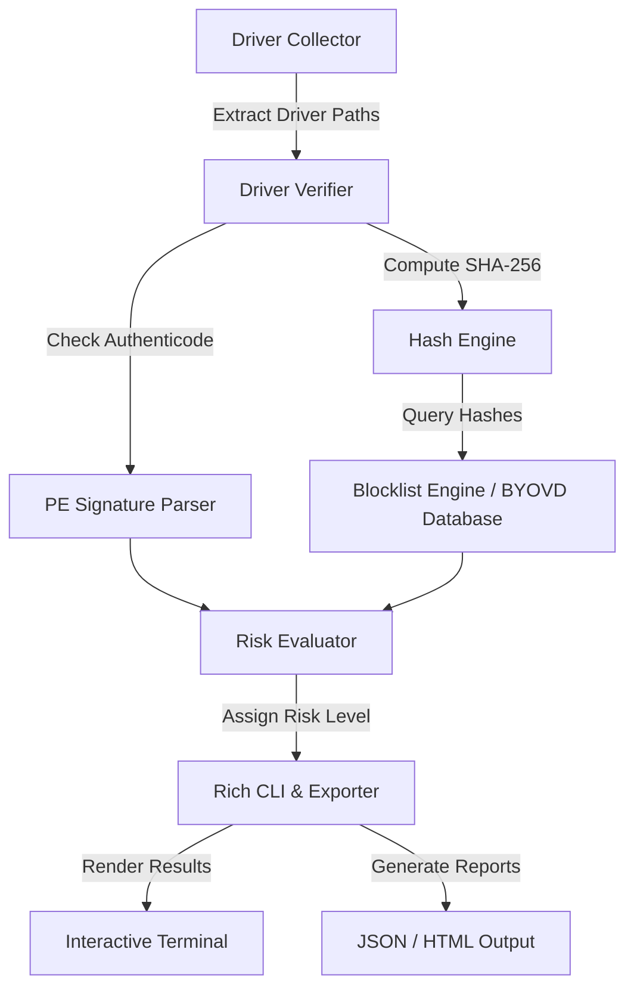

# 🛡️ Secure Driver Verification System (SDVS)

[](https://opensource.org/licenses/MIT)
[](https://github.com/aa7u/secure-driver-verification-system/actions)
[](#)
[](#)

An open-source security tool engineered to audit, verify, and assess Windows kernel drivers before execution. Operating at the kernel level, device drivers possess elevated system privileges, making untrusted or unsigned drivers a significant security risk.

**SDVS** helps mitigate supply chain risks and **Bring Your Own Vulnerable Driver (BYOVD)** attacks by inspecting digital signatures, trusted vendors, vulnerable driver blocklists, and binary integrity.

---

# 🎬 Live Audit Demonstration


---

# 🏗️ System Architecture & Data Flow



---

# 🛡️ Threat Model & Security Design

## Covered Threats

- 🦠 **Bring Your Own Vulnerable Driver (BYOVD)**  
  Detects legitimately signed but vulnerable drivers by comparing SHA-256 hashes against Microsoft and LOLDrivers blocklists.

- 🔓 **Unsigned Kernel Drivers**  
  Flags unsigned or invalid `.sys` drivers before execution.

- 🧪 **Test-Signed Drivers**  
  Detects drivers signed with test certificates or intended only for development environments.

## Security Philosophy

### Zero Trust

No driver is trusted solely because it has a valid digital signature. Every driver is additionally verified using cryptographic hashes and vulnerable driver databases.

### Defense in Depth

Multiple verification layers reduce the chance of malicious drivers bypassing detection:

- Digital signature verification
- SHA-256 integrity verification
- Vulnerable driver blocklist matching
- PE metadata analysis
- Risk scoring engine

---

# ⚠️ Current Limitations

- Static analysis only (no runtime monitoring).
- Does not inspect kernel memory or detect DKOM.
- Uses local vulnerable driver databases.
- Online threat intelligence (VirusTotal) is planned for future releases.

---

# ✨ Features

- 🔍 Scan installed Windows kernel drivers
- ✍️ Verify Authenticode digital signatures
- 🛡️ Detect Microsoft-blocklisted vulnerable drivers
- 🔐 Compute SHA-256 hashes
- 🎨 Interactive Rich CLI interface
- 📄 Export reports to JSON and HTML
- ⚠️ Automatic driver risk assessment
- 📊 Color-coded security results

---

# 🗺️ Development Roadmap

| Version | Features | Status |
|---------|----------|--------|
| **v0.1.0 – v0.2.0** | PE parsing, Signature verification, Rich CLI, HTML/JSON export | ✅ Completed |
| **v0.3.0** | Risk engine, Microsoft vulnerable driver blocklist, BYOVD detection | ✅ Completed |
| **v0.4.0** | Extended PE metadata, LOLDrivers integration, Custom scan paths | ⏳ In Progress |
| **v0.5.0** | Certificate chain validation, CRL/OCSP checking, Optional YARA scanning | 📅 Planned |
| **v1.0.0** | ETW monitoring, Kernel memory inspection, VirusTotal API, SIEM/SARIF export | 📅 Planned |

---

# 🚀 Quick Start

## Requirements

- Windows 10 or Windows 11
- Python 3.10+
- Administrator privileges (recommended)

## Installation

```powershell
# Clone the repository
git clone https://github.com/aa7u/secure-driver-verification-system.git

# Enter the project
cd secure-driver-verification-system

# Create a virtual environment
python -m venv .venv

# Activate it
.\.venv\Scripts\Activate.ps1

# Install dependencies
pip install -r requirements.txt
```

## Run the Scanner

```powershell
# Interactive scan
python main.py

# Scan first 10 drivers and export HTML report
python main.py --limit 10 --export html
```

---

# 🧪 Running Tests

```powershell
python -m pytest
```

---

# 📂 Example Output

```text
┌─────────────────────────────┬──────────────┬──────────────┐
│ Driver                      │ Signature    │ Risk         │
├─────────────────────────────┼──────────────┼──────────────┤
│ disk.sys                    │ Valid        │ LOW          │
│ example.sys                 │ Unsigned     │ HIGH         │
│ vulnerable.sys              │ Valid        │ CRITICAL     │
└─────────────────────────────┴──────────────┴──────────────┘
```

---

# 📜 License

This project is licensed under the MIT License.

See the [LICENSE](LICENSE) file for details.