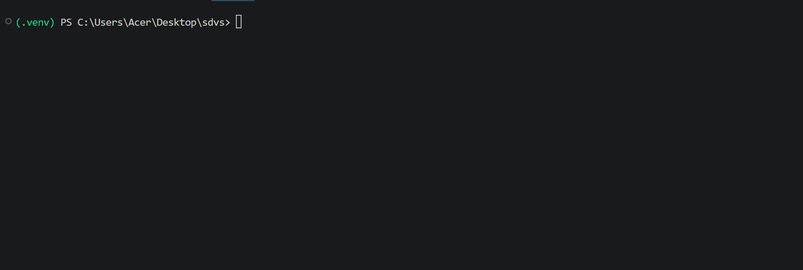

# 🛡️ Secure Driver Verification System (SDVS)

[](https://opensource.org/licenses/MIT)
[](#)
[](#)

An open-source security tool designed to audit, verify, and assess system drivers before installation. Operating at the Kernel Level, device drivers possess elevated system privileges—making untrusted or unsigned drivers a severe security risk. **SDVS** mitigates supply chain risks by inspecting driver signatures, vendor sources, and integrity before execution.

---

## 🎬 Live Audit Demonstration



---

## ✨ Key Features

* 🔍 **System Driver Auditing:** Scans and inventories currently installed Windows kernel drivers.
* ✍️ **Digital Signature Verification:** Parses PE Security Directories (`IMAGE_DIRECTORY_ENTRY_SECURITY`) to validate Authenticode digital signatures.
* 🔐 **Cryptographic Verification:** Computes accurate SHA-256 binary hashes for file integrity checks.
* 🏷️ **Release Channel Inspection:** Identifies whether a driver package is Stable, WHQL-certified, or Beta/Experimental.
* ⚠️ **Risk Assessment Matrix:** Evaluates drivers and dynamically assigns security ratings (**LOW RISK**, **MEDIUM RISK**, or **HIGH RISK**).
* 💡 **Actionable Recommendations:** Provides clear safety guidance and recommendations before loading drivers.

---

## 🗺️ Roadmap

- [x] Initial kernel driver inventory collector module.
- [x] SHA-256 cryptographic hashing integration.
- [x] PE Authenticode digital signature validation.
- [ ] Exporting audit results to structured JSON / HTML reports.
- [ ] Official Vendor metadata cross-checking (Intel, AMD, NVIDIA).
- [ ] Interactive CLI interface (Rich / Typer).

---

## 🚀 Quick Start

### Prerequisites
* OS: Windows 10/11
* Python 3.10+
* Administrative Privileges (Recommended for deep system driver reads)

### Installation & Execution

```powershell
# Clone the repository
git clone [https://github.com/aa7u/secure-driver-verification-system.git](https://github.com/aa7u/secure-driver-verification-system.git)

# Navigate into the project directory
cd secure-driver-verification-system

# Set up virtual environment & install dependencies
python -m venv .venv
.\.venv\Scripts\Activate.ps1
pip install -r requirements.txt

# Run the driver audit system
python main.py
